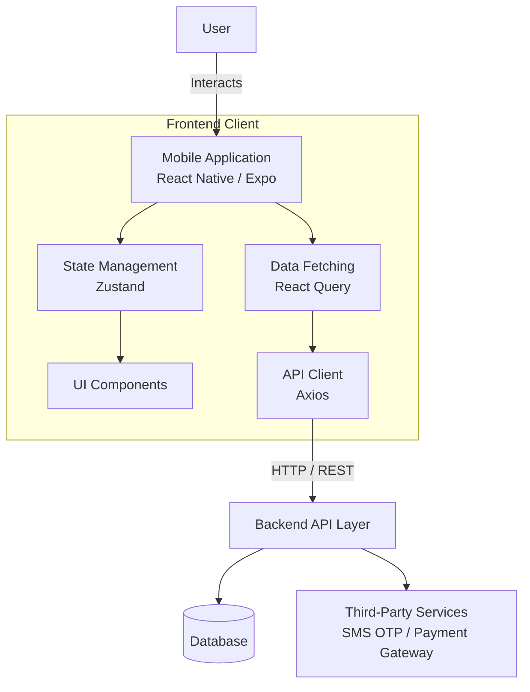
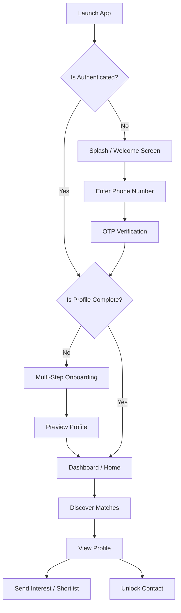

# 💍 VivahaMatrimony

> A modern, secure, and intuitive mobile platform designed to bring hearts together.

VivahaMatrimony is a comprehensive mobile application built for users seeking meaningful relationships and life partners. Built with performance and user experience in mind, it provides a seamless journey from onboarding to discovering potential matches, managing interests, and unlocking contact details safely.

The application leverages a modern technology stack to deliver a smooth, native-like experience on both iOS and Android, ensuring that the search for a life partner is as delightful and effortless as possible.


---

## ✨ Features

### 🔐 Authentication
- **Secure Phone Auth**: Phone number entry and validation.
- **OTP Verification**: Fast and secure one-time password login/registration.
- **Session Management**: Persistent and secure auth states using Zustand.

### 👤 Profile Management & Onboarding
- **Comprehensive Setup**: Step-by-step onboarding (Personal details, Education, Career, Family, Community).
- **Partner Preferences**: Granular preferences to find the perfect match.
- **Photo Management**: Upload and manage profile photos.
- **Profile Preview**: Review profile details before making them public.
- **Consent Handling**: Contact consent integration for privacy.

### 🔎 Discovery & Matching
- **Discover Feed**: Browse through tailored and recommended profiles.
- **Advanced Filters**: Refine search results based on specific criteria.
- **Shortlisting**: Save/favorite profiles to revisit them later.

### 💬 Connections & Interactions
- **Interests**: Express interest in profiles and manage incoming requests.
- **Unlock Contact**: Securely unlock phone numbers or contact details of matches.
- **Notifications**: Stay updated with profile views, interests received, and system alerts.

### 💳 Membership & Payments
- **Premium Memberships**: Upgrade plans via integrated services.
- **Payment Success Flow**: Seamless post-purchase user experience.

---

## 🏗️ System Architecture



- **Mobile Application**: Built with Expo Router for file-based routing and React Native for UI rendering.
- **State Management**: Zustand handles global UI states (e.g., Auth state, Onboarding progress).
- **Data Fetching**: TanStack React Query manages remote data fetching, caching, and synchronization.
- **API Client**: Axios handles outgoing requests to the backend endpoints (Auth, Profiles, Interests, Notifications, etc.).

---

## 🔄 Application Flow

### Primary User Journey



### Important Flows
- **Authentication Flow**: Users log in via their phone number. An OTP is sent and verified via the backend APIs. Session tokens are securely stored and managed by `authStore`.
- **Profile Setup Flow**: A robust multi-screen process utilizing React Hook Form + Zod for validation. Progress is tracked via `onboardingStore`.
- **Matching Flow**: Users navigate the `Discover` tab to browse profiles. Actions like "Shortlist" or "Send Interest" trigger mutations via `React Query` interacting with `favorites.service` and `interests.service`.

---

## 📱 Application Screens

### Onboarding & Authentication
- **Splash / Welcome**: `app/(auth)/welcome.tsx` - Initial landing screen.
- **Phone Input**: `app/(auth)/phone.tsx` - Enter mobile number for login.
- **OTP Verification**: `app/(auth)/otp.tsx` - Verify the received code.
- **Onboarding Steps**: `app/(onboarding)/*` - Includes screens for About You, Community, Education/Career, Family, Location, Partner Preferences, Photo upload, and Consent.

### Main Application (Tabs)
- **Home**: `app/(main)/(tabs)/index.tsx` - Dashboard overview and daily recommendations.
- **Discover**: `app/(main)/(tabs)/discover.tsx` - Main matching and search feed.
- **Interests**: `app/(main)/(tabs)/interests.tsx` - Sent and received connection requests.
- **Shortlist**: `app/(main)/(tabs)/shortlist.tsx` - Favorited or saved profiles.
- **Notifications**: `app/(main)/(tabs)/notifications.tsx` - Activity alerts and updates.
- **Profile**: `app/(main)/(tabs)/profile.tsx` - Current user's profile view.
- **More**: `app/(main)/(tabs)/more.tsx` - Additional app navigation (Settings, Membership).

### Secondary Screens
- **User Profile View**: `app/profile/[id].tsx` - Detailed view of another user's profile.
- **Unlock Contact**: `app/(main)/unlock-contact.tsx` - Premium feature to view details.
- **Payment Success**: `app/(main)/payment-success.tsx` - Confirmation after membership purchase.
- **Settings**: `app/settings/index.tsx` - App configuration and preferences.

> *Screenshots Placeholder: Add images to `docs/screenshots/` and uncomment below.*
> 
> <!-- 
>  
>  
>  
> -->

---

## 🧩 Project Structure

```text
matrimonyapp/
├── app/                        # Expo Router Pages
│   ├── (auth)/                 # Authentication screens (Phone, OTP)
│   ├── (main)/                 # Core authenticated screens
│   │   ├── (tabs)/             # Bottom navigation tabs
│   │   ├── payment-success.tsx # Transaction confirmation
│   │   └── unlock-contact.tsx  # Contact reveal modal
│   ├── (onboarding)/           # Profile creation wizard
│   ├── profile/                # Dynamic profile viewing
│   ├── settings/               # User settings
│   └── _layout.tsx             # Root layout and navigation config
├── assets/                     # Static assets (Images, Fonts)
├── src/                        # Source Code
│   ├── components/             # Reusable UI components (Buttons, Inputs, Cards)
│   ├── constants/              # App-wide constants and config
│   ├── hooks/                  # Custom React hooks
│   ├── lib/                    # Library configurations (React Query, Mocks)
│   ├── schemas/                # Zod validation schemas
│   ├── services/               # API clients (Auth, Profile, Search, etc.)
│   ├── store/                  # Zustand state management (Auth, Onboarding)
│   ├── theme/                  # Styling tokens (Colors, Typography, Spacing)
│   ├── types/                  # TypeScript interface definitions
│   └── utils/                  # Helper functions
├── package.json                # Project dependencies
└── app.json                    # Expo configuration
```
